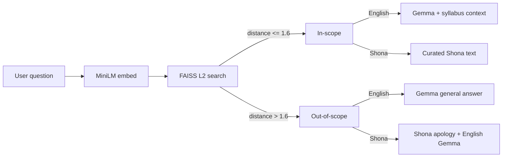

# Offline Shona AI Coding Tutor

An offline AI coding tutor for the **Africa Deep Tech Challenge 2026 — Laptop LLM Challenge**. Teaches Python and CS fundamentals in English and Shona, running fully on-device with no internet required.

## What This Is

**Team:** `group21` · **Domain:** `coding_assistants` · **Languages:** English and Shona (`en`/`sn`)

This submission runs **Gemma-2-2b-it Q4_K_M** through llama.cpp on CPU only, with a local `all-MiniLM-L6-v2` embedder and FAISS retrieval over a curated bilingual syllabus. Official participant-mode peak RSS: **2.75 GB** (within the 7 GB budget). See [REPORT.md](REPORT.md) for design rationale, benchmarks, and known limitations.

## Features

- Fully offline runtime after setup: Gemma-2-2b-it Q4_K_M inference through llama.cpp, with a local MiniLM embedder and FAISS index
- Two interactive modes: ask a coding question or generate topic-specific practice questions
- English and Shona support, including shorthand language selection (`en`/`e`/`1` and `sn`/`s`/`0`)
- Retrieval-augmented answers from a curated **53-topic** Python and CS syllabus
- Curated, human-verified Shona explanations and practice questions for in-scope topics
- Live English generation for in-scope answers and practice questions, grounded in retrieved syllabus context
- Honest out-of-scope handling: English requests receive a general coding answer; Shona requests receive a Shona apology followed by an English answer
- CPU-only and within the 7 GB RAM budget (official peak RSS: 2.75 GB)

## Setup

**Prerequisites:** Python 3, `wget`, `build-essential`, `cmake`, ~8 GB RAM, and internet access once for model downloads.

```bash
# 1. Clone and enter the repo
git clone https://github.com/tmachingur-code/adtc-shona-coding-tutor.git
cd adtc-shona-coding-tutor

# 2. Create virtual environment
python3 -m venv adtc-tutor-env
source adtc-tutor-env/bin/activate

# 3. Install build tools (needed for llama-cpp-python)
sudo apt update && sudo apt install build-essential cmake wget -y

# 4. Install dependencies (CPU PyTorch first, then the rest)
pip install torch==2.13.0 --index-url https://download.pytorch.org/whl/cpu
pip install -r requirements.txt

# 5. Download the GGUF model and MiniLM embedder into model/
#    Creates model/ automatically; requires internet once; no credentials required
bash download_model.sh

# 6. Build the RAG index from the full syllabus (required after setup or syllabus changes)
python3 build_index.py

# 7. Run the tutor
python3 rag_tutor.py
```

The `model/` directory is gitignored and not committed. `download_model.sh` creates it and downloads the Gemma GGUF weights plus the MiniLM embedder.

## Usage

You'll be asked to choose a mode and a language, then either ask a question or name a topic. The language prompt accepts full names or shorthand aliases.

**Ask mode (Shona example):**

```
Choose mode - (1) Ask a question, (2) Get practice questions: 1
Language (english/shona, or 1=english, 0=shona): shona
Bvunza mubvunzo wekodhi: Chii chinonzi for loop

--- Tutor's Answer ---
Musoro: For Loops
Tsanangudzo: For loop inodzokorora chikamu chekodhi kamwe nekamwe...
```

**Practice mode:** enter `2`, choose a language, then provide a topic (`Which topic do you want practice questions on?` in English, or `Mibvunzo yekudzidzira pamusoro pei?` in Shona). English practice questions are generated by Gemma; in-scope Shona practice questions come from the curated syllabus.

## How It Works

The `embedder.py` module loads the local `all-MiniLM-L6-v2` sentence-transformer from `model/` with `local_files_only=True`. It never makes a Hugging Face network request at runtime and reports the download command if the local weights are missing. `build_index.py` uses the same loader to embed the syllabus; `rag_tutor.py` uses it to embed each user question.

Your question is embedded and matched against a FAISS index built from each syllabus topic and English explanation. Matches at FAISS L2 distance `<= 1.6` are treated as in-scope. English answers and practice questions are generated live by Gemma using the retrieved context. In-scope Shona answers and practice questions use curated, human-verified content directly (see [REPORT.md](REPORT.md) for why).

For out-of-scope questions, English mode generates a general beginner-friendly coding answer without syllabus context. Shona mode returns a Shona explanation that the topic is unavailable, followed by an English model answer. This keeps the tutor useful without presenting an ungrounded answer as syllabus-backed.



**Note on Shona input:** questions phrased fully in English, or in Shona with an embedded English technical term (e.g. "Chii chinonzi for loop"), match reliably. Fully Shona questions with no English term do not currently match reliably — see [REPORT.md](REPORT.md) for details.

## Syllabus Coverage

53 topics total, grouped as follows:

- **Python basics (3):** Variables · Data Types (int, float, str, bool) · Input and Output (input(), print())
- **Control flow (3):** If/Else Conditionals · For Loops · While Loops
- **Functions (3):** Defining and Calling Functions · Parameters and Return Values · Variable Scope
- **Data structures (3):** Lists · Dictionaries · Basic String Manipulation
- **Algorithms and reasoning (4):** Sorting Numbers · Linear Search · Binary Search · Big-O Notation (Why Some Code Is Slow)
- **Debugging (14):** SyntaxError · TypeError · IndexError · NameError · Tracebacks · ValueError · ZeroDivisionError · KeyError · AttributeError · IndentationError · Infinite loops · Off-by-one errors · print()-based tracing · Reading error messages systematically
- **Algorithm design tools (10):** Algorithm tools intro · Sequence · Selection · Repetition · Flowcharts · Pseudocode · Top-down/bottom-up design · Trace tables · Interpreting/debugging algorithms · Full-project algorithm design
- **Program structure and operators (13):** Program structure · Arithmetic/logical/relational operators · Nested control · Text-based menus · Error types overview · try/except · Multi-function projects · Structured testing · f-strings · File I/O · List comprehensions

## Checking Performance

**Own benchmark script** (RAM + speed, includes embedder/index load):

```bash
python3 benchmark.py
```

**Official ADTC profiler** (throughput, memory, thermals, and model metadata):

```bash
pip install "git+https://github.com/Africa-Deep-Tech-Foundation/adtc-profiler.git"
adtc-profiler run --submission . --mode participant --output submission.json
```

See [REPORT.md](REPORT.md) for full design rationale, constraints, benchmarks, and known limitations.

## Repository Structure

```
├── metadata.json          # Team, model, and test prompt metadata (ADTC submission)
├── submission.json        # Profiler output from participant-mode run
├── download_model.sh      # Creates model/ and downloads Gemma GGUF + MiniLM
├── REPORT.md              # Technical writeup for judges
├── model/                 # Created by download_model.sh (gitignored, not committed)
│   ├── gemma-2-2b-it-Q4_K_M.gguf
│   └── all-MiniLM-L6-v2/
├── data/
│   ├── syllabus.json      # Curated CS syllabus (English + Shona, 53 topics)
│   ├── syllabus_map.json  # Generated lookup used by the RAG pipeline
│   └── syllabus.index     # Generated FAISS index
├── rag_tutor.py           # Main application (CLI tutor)
├── embedder.py            # Loads the local MiniLM sentence embedder
├── build_index.py         # Builds the FAISS index from syllabus.json
├── benchmark.py           # Own RAM/speed benchmark script
└── requirements.txt
```

## License

MIT — see `LICENSE`.

## Acknowledgements

Built for the **Africa Deep Tech Challenge 2026 — Laptop LLM Challenge**, hosted by the Africa Deep Tech Foundation.
